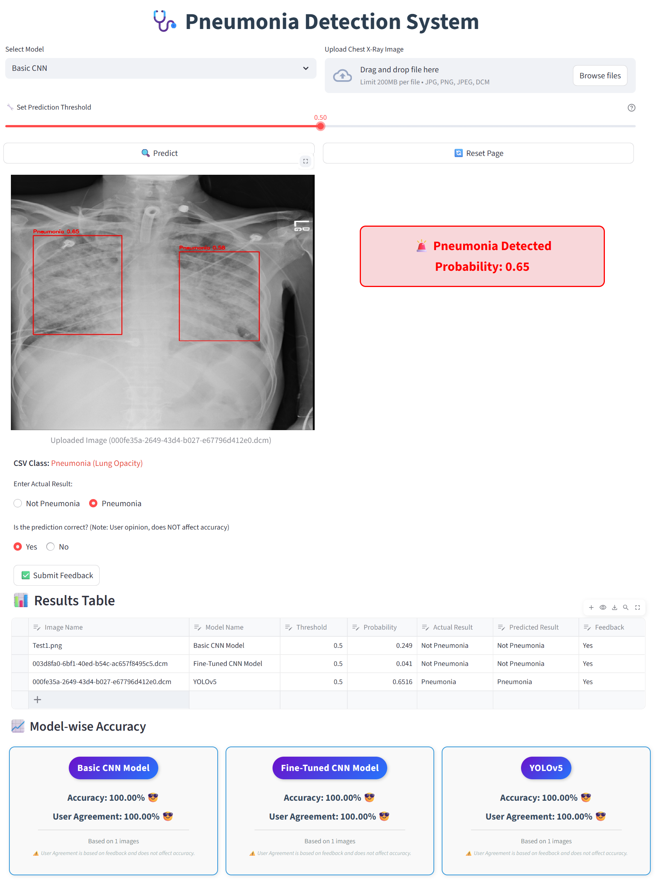
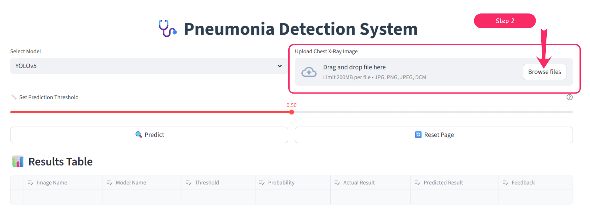
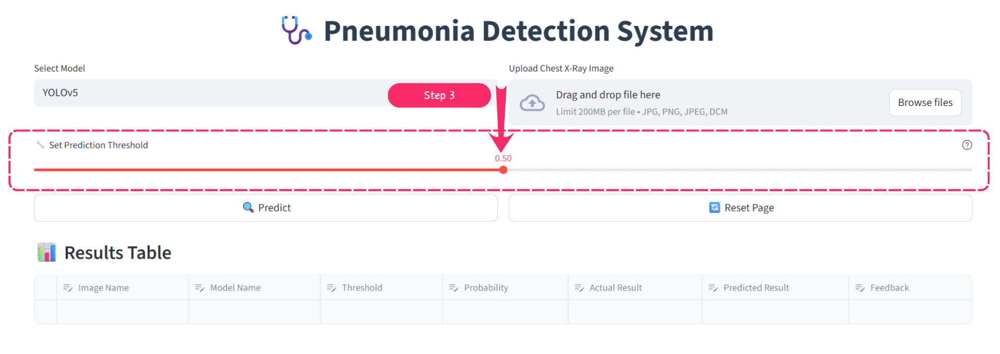
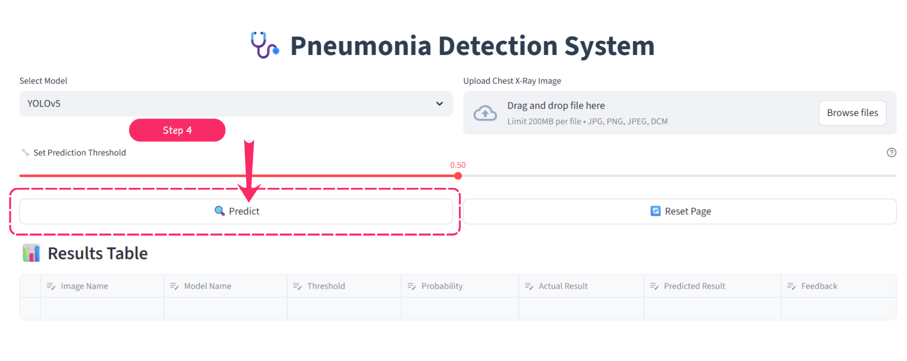
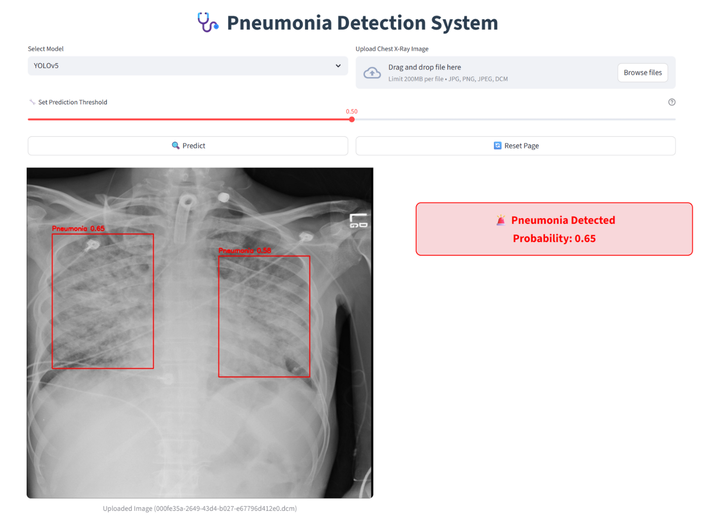
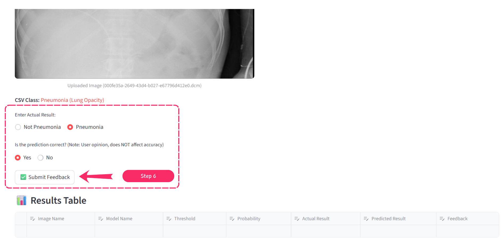
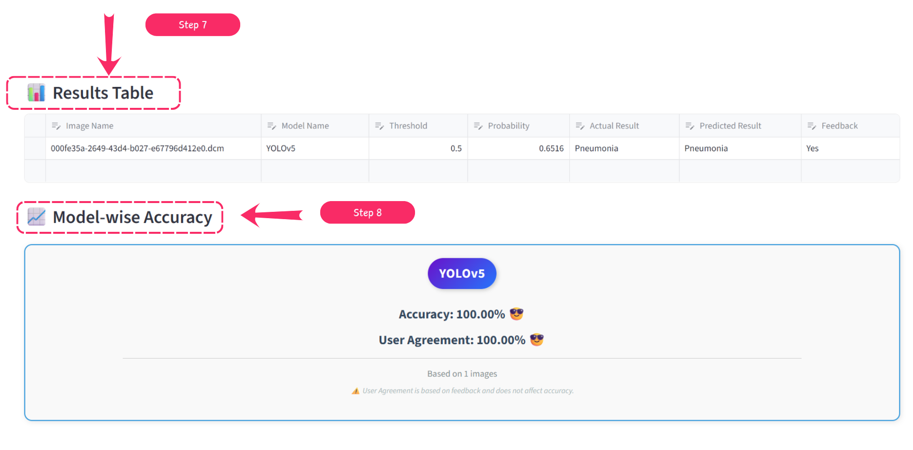
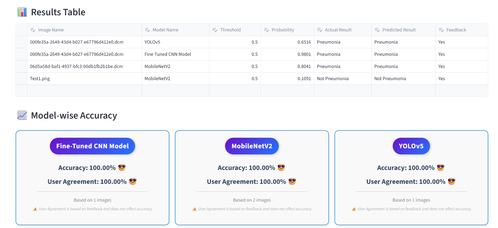
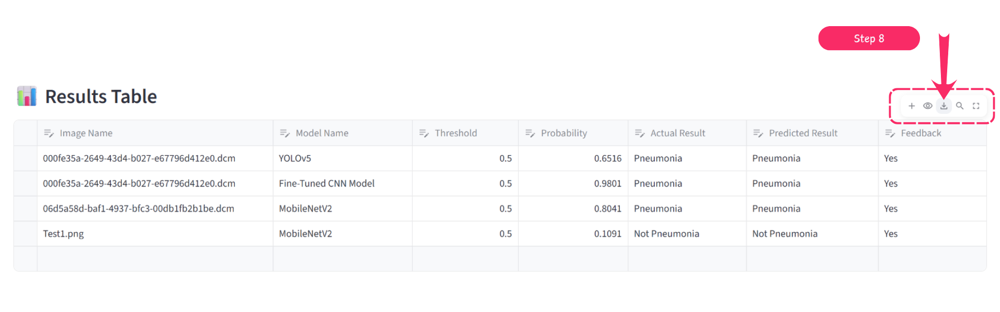

# 🫁 Pneumonia Detection Using Deep Learning


> An AI-powered pneumonia detection system that compares 6 deep learning models with explainable predictions, real-time inference, and an interactive web interface.

[**🎥 Watch Demo Video**](https://youtu.be/QM1njWx7o3Q) | [**🐙 GitHub Repository**](https://github.com/SaurabhSingh86/Portfolio-Projects/tree/main/Pneumonia-Detection-Using-Deep-Learning)

---

## 📝 Problem Statement

Pneumonia kills a child every 43 seconds worldwide (WHO, 2019). In many regions, there's no radiologist available to read chest X-rays quickly enough, leading to delayed diagnosis and preventable deaths.

This project addresses this critical challenge by developing an **AI-powered pneumonia detection system** that analyzes chest X-rays in under 2 seconds, providing doctors with a reliable second opinion and highlighting affected lung regions for better clinical decision-making.

**Key Challenges Addressed:**

- ⏱️ **Time-critical diagnosis** in emergency situations
- 👨‍⚕️ **Shortage of radiologists** in rural/remote areas
- 🎯 **Accuracy concerns** with manual interpretation
- 💡 **Lack of explainability** in black-box AI systems

---

## 🚀 Features

### 🔬 Multi-Model AI Engine

- **6 AI Models Comparison**: Custom CNN, Fine-tuned CNN, ResNet50, MobileNetV2, DenseNet121, YOLOv5
- **Transfer Learning**: Leverages pre-trained ImageNet models for improved accuracy
- **Ensemble Ready**: Compare predictions across multiple architectures

### 🎨 Interactive User Interface

- **Streamlit-based UI**: Clean, intuitive interface for medical professionals
- **FastAPI Backend**: High-performance REST API for scalable deployment
- **Multi-format Support**: Accepts JPG, PNG, and medical DICOM files
- **Adjustable Threshold**: Customize sensitivity (default: 0.5) for different clinical scenarios
- **Real-time Predictions**: Get results in under 2 seconds

### 🔍 Explainable AI

- **YOLOv5 Visualization**: Bounding boxes showing exact infected lung regions
- **Confidence Scores**: Transparent probability metrics for all predictions
- **Color-coded Results**: Green = Normal, Red = Pneumonia
- **Model Comparison**: Side-by-side performance tracking

### 📊 Performance Tracking

- **Feedback System**: Collect user validation for continuous improvement
- **CSV Export**: Download predictions and metrics for analysis
- **Model-wise Accuracy**: Track performance per architecture
- **Confusion Matrix**: Detailed evaluation metrics

### 🚀 Production-Ready

- **RESTful API**: Easy integration with hospital PACS systems
- **Async Processing**: Handle multiple requests simultaneously
- **Auto-generated Docs**: FastAPI Swagger documentation
- **Scalable Architecture**: Frontend and backend deploy independently

---

## 🛠️ Tech Stack

**Deep Learning & ML**

- Python 3.8+
- TensorFlow / Keras
- PyTorch
- YOLOv5
- OpenCV
- Scikit-learn

**Backend & API**

- FastAPI
- Uvicorn (ASGI server)
- Pydantic (data validation)

**Frontend**

- Streamlit

**Data Processing**

- NumPy
- Pandas
- Pydicom (DICOM medical imaging)
- PIL (Python Imaging Library)

**Visualization**

- Matplotlib
- Seaborn

---

## ⚙️ Setup Instructions

### **1. Clone the repository:**

```bash
git clone https://github.com/SaurabhSingh86/pneumonia-detection-deep-learning.git
cd pneumonia-detection-deep-learning
```

### **2. Create a virtual environment & activate it:**

```bash
python -m venv med_env

# Linux / Mac
source med_env/bin/activate

# Windows
med_env\Scripts\activate

```

### 3. **Install dependencies:**

```bash
pip install -r requirements.txt
```

**4. Download the dataset:**
Create a .env file inside part3_doc_ai/ with:

```bash
# Download from Kaggle:
# https://www.kaggle.com/datasets/paultimothymooney/chest-xray-pneumonia

# Extract to data/ folder
# Expected structure:
# data/train/NORMAL/
# data/train/PNEUMONIA/
# data/val/NORMAL/
# data/val/PNEUMONIA/
# data/test/NORMAL/
# data/test/PNEUMONIA/
```

### **5. Download pre-trained models:**

```bash
# Models are too large for GitHub (>100MB each)
# Download from: [Add your Google Drive / Release link]
# Place all .h5 and .pt files in models/ directory
```

### **6. Setup .env file (optional):**

```bash
# Run Streamlit UI
streamlit run form_ui.py

# Run FastAPI backend
uvicorn fast_api:app --port 8003
```

### **6. Run the application:**

```bash
# Run Streamlit UI
streamlit run form_ui.py

# Run FastAPI backend
uvicorn fast_api:app --port 8003
```

### Then open below link in browser.

```
http://localhost:8501/
```

## 📸 Screenshots / Demo

**Version 1**

**Full UI**


**_Step 1_ : Select The Model**


**_Step 2_ : Upload X-ray image for test**


**_Step 3_ Adjust Threshold if needed (by default 0.5)**


**_Step 4_ : Click on Predict**


**_Step 5_ : Prediction Result show with Color Coaded**


**_Step 6_ : After User Review Click on Submit Feedback**


**_Step 7_ : Result Table & Model-wise Accuracy Updated Automatically**


**_Step 8_ : Repeat above process & test multiple image with multiple models**


**_Step 9_ : Download as CSV**


---

## ⚙️ How It Works

1. Select The Model
2. Upload X-ray image for test
3. Adjust Threshold if needed (by default 0.5)
4. Click on Predict
5. Prediction Result show with Color Coaded (Green: Not Pneumonia & Red: Pneumonia Detection)
6. After User Review Click on Submit Feedback
7. Result Table & Model-wise Accuracy Updated Automatically
8. Repeat above process & test multiple image with multiple models
9. Download as CSV.

---

## 📊 Example Output

****

---

## 📊 Future Enhancements

---

## 👨‍💻 Author

**Saurabh Singh**
🔗 [LinkedIn](https://www.linkedin.com/in/saurabh-singh-621388182/) |
[Project Link](https://github.com/SaurabhSingh86) |
[YouTube](https://www.youtube.com/@SaurabhSinghAIML)
